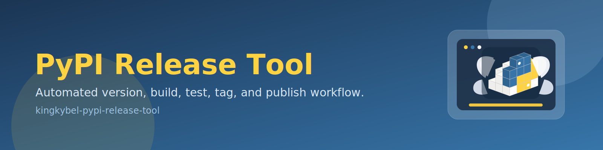

# kingkybel-pypi-release-tool

Automated release workflow for Python packages, including version bumping, test execution, build, upload, and git tagging.

## Features

- 🚀 **Automated Release Flow**: Handles release lifecycle from version checks to final upload
- 🧪 **Integrated Testing**: Runs project tests before packaging
- 📦 **Build + Upload**: Builds distributions and uploads with Twine
- 🔢 **Version Management**: Supports patch, minor, and major bumps
- 🧰 **Interpreter Detection**: Finds available Python interpreters and selects highest version
- 🏷️ **Git Integration**: Commits, pushes, and tags release versions
- 🛟 **Dry-Run Support**: Preview release actions without changing repository state

## Installation

```bash
pip install kingkybel-pypi-release-tool
```

Or from source:

```bash
git clone https://github.com/kingkybel/PyPIReleaseTool.git
cd PyPIReleaseTool
pip install -e .
```

## Quick Start

```bash
# Default patch release
python release_to_pypi.py

# Minor or major release
python release_to_pypi.py --minor
python release_to_pypi.py --major

# Dry-run only
python release_to_pypi.py --dry-run
```

## CLI Usage

```bash
python release_to_pypi.py [--repo REPO_DIR] [--minor] [--major] [--dry-run]
```

Options:
- `--repo`, `-r`: Target repository directory (defaults to current directory)
- `--minor`, `-m`: Increment minor version (`x.y.z` -> `x.y+1.0`)
- `--major`, `-M`: Increment major version (`x.y.z` -> `x+1.0.0`)
- `--dry-run`: Show actions without changing files, git state, or PyPI

## Release Script

For packaging-only flows aligned with modern publishing practice:

```bash
./release.sh --help
./release.sh --testpypi-only
./release.sh --skip-testpypi
./release.sh --skip-upload
```

## Package Layout

```text
PyPIReleaseTool/
├── assets/
│   └── banners/
│       └── pypi-release-tool-banner.svg
├── pypi_release_tool/
│   ├── __init__.py
│   ├── __main__.py
│   └── release_tool.py
├── release_to_pypi.py
├── pyproject.toml
├── setup.py
├── release.sh
├── requirements.txt
└── README.md
```

## Requirements

- Python 3.8+
- Git configured with push access
- Twine credentials configured for upload (`TWINE_USERNAME`/`TWINE_PASSWORD`)

## Notes

- The tool expects a valid `pyproject.toml` and package `__init__.py` with a `__version__` field.
- The default workflow assumes `main` as the primary git branch.
- Uploads target production PyPI by default in the Python workflow; use `release.sh` for TestPyPI-first publishing.
